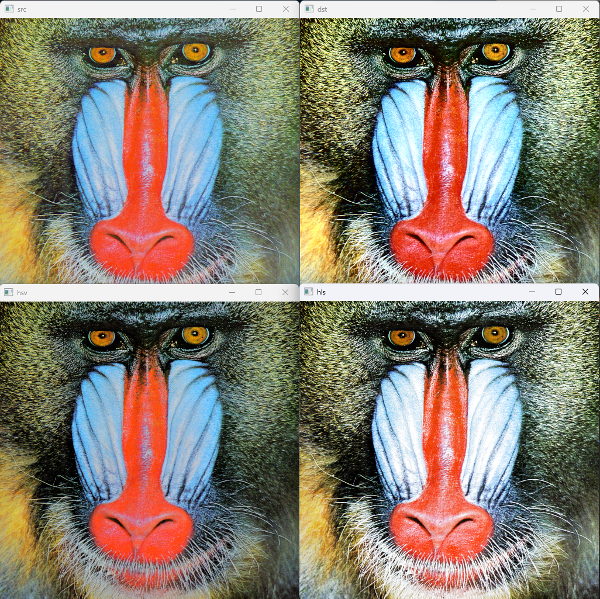

## 컬러 영상 처리의 기초
* * *
이미지 반전
채널이 한 개인 `8UC1`의 img 파일의 경우   
`Mat img = imread('name.extensions', IMREAD_GRAYSCALE)`   
반전을 하려면   
`Mat img2 = 255 - img`
하면 되지만   
채널이 3개인 ``32FC3인` 경우에
```c++
   Mat img2 = 255 - img
-> Mat img2 = Scalar(255) - img
-> Mat img2 = (Scalar.val = 255, 0, 0, 0) - img
```
이기 때문에 Blue 영역에서만 반전이 일어난다

따라서 BGR채널을 가진 이미지를 반전하려면
`Mat img2 = Scalar(255, 255, 255) - img`
로 해야한다.
   
또한 img2의 값을 참조할 때
`img2.at<Vec3b>`와 같이 참조해야만 한다
   
[포인터와 레퍼런스](https://modoocode.com/141)

명도(Brightness, Luminance) Y를 표현할 때,
우리의 눈은 Red, Green, Blue에 대한 감도가 다르기 때문에
Y = 0.213R + 0.715G + 0.072B가 된다
아날로그 출력장치라면
Y = 0.299R + 0.587G + 0.114B를 사용한다 --- (1)

따라서 `gray = 0.299 * r + 0.587 * g + 0.114 * b` 라고 할 수 있다
계산 속도를 위해 `gray = (uchar)((299 * r + 597 * g + 114 * b) / 1000)` 이라 할 수 있고
`#define RGB2GRAY(r, g, b)  ((4899*(r) + 9617*(g) + 1868*(b)) >> 14)`
인 매크로 함수로 정의하여 많이 사용한다
각 값은 (1)의 식에 2^14을 곱한 값(반올림)이며 `shift`연산자를 사용하기 위한 2BYTE 정수 중 2^16보다 작은 수 이다

## 색공간
* * *
HSV 색 모델에서
H는 0~360 degrees를 8bit로 표현하기 힘들기 때문에
2로 나눈 0 ~ 179로 표현한다

## 컬러 영상 처리
* * *   
SRC, YCrCg   
HSV, HLS
